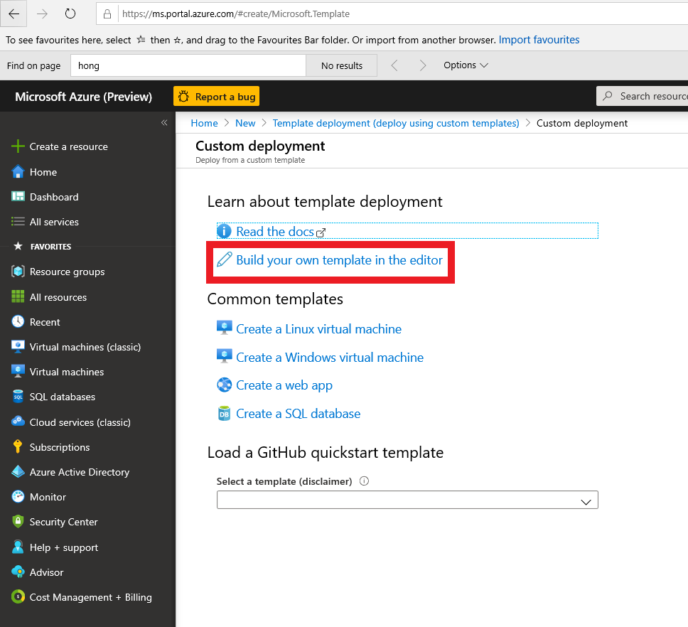
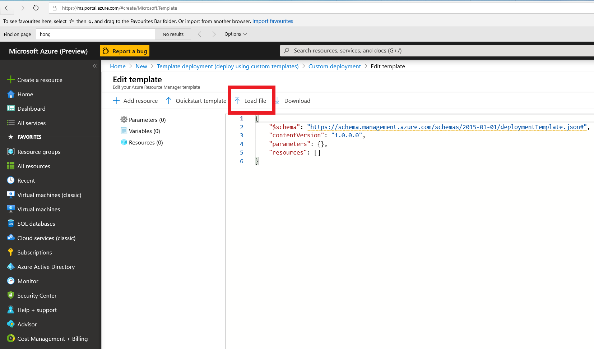
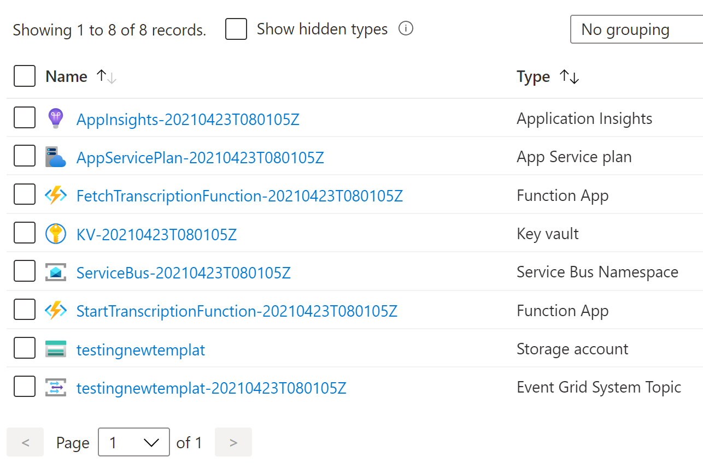
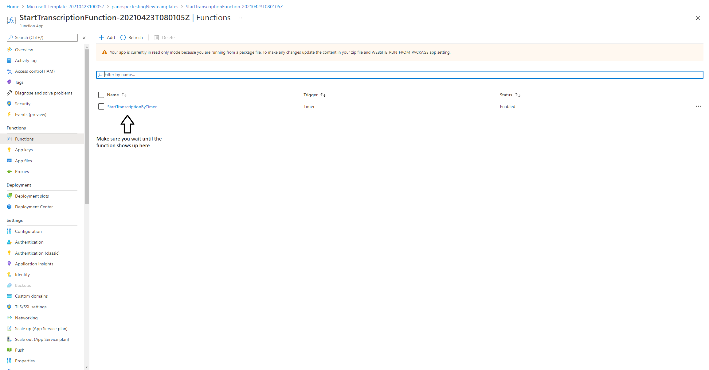
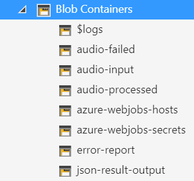

# Getting started with the Call Batch Analytics

This call batch analytics component is using [Ingestion Client](https://github.com/Azure-Samples/cognitive-services-speech-sdk/tree/master/samples/ingestion) that helps transcribe your audio files without any development effort. The Ingestion Client monitors your dedicated Azure Storage container so that new audio files are transcribed automatically as soon as they land.

This tool uses multiple Azure Cognitive Services to get insights from call recordings. It uses Azure Speech to transcribe calls and then Azure Text Analytics for various analytics tasks (including sentiment analysis, PII detection/redection etc). Insights extracted by these Azure AI services are then stored to Azure SQL database for further analysis and visualization (using Power BI or other tools).

Think of this tool as an automated & scalable transcription solution for all audio files in your Azure Storage. This tool is a quick and effortless way to transcribe your audio files or just explore transcription.

Using an ARM template deployment, all the resources necessary to seamlessly process your audio files are configured and turned on.

# Architecture

The Ingestion Client is optimized to use the capabilities of the Azure Speech infrastructure. It uses Azure resources to orchestrate transcription requests to the Azure Speech service using audio files as they appear in your dedicated storage containers. 

The following diagram shows the structure of this tool as defined by the ARM template.

When a file lands in a storage container, the Grid event indicates the completed upload of a file. The file is filtered and pushed to a Service bus topic. Code in Azure Functions triggered by a Service bus message picks up the event and creates a transmission request using the Azure Speech services batch pipeline. When the transmission request is complete, an event is placed in another queue in the same service bus resource. A different Azure Function triggered by the completion event starts monitoring transcription completion status. When transcription completes, the Azure Function copies the transcript into the same container where the audio file was obtained.

# Setup Guide

Follow these steps to set up and run the tool using ARM templates.

## Prerequisites

An [Azure Account](https://azure.microsoft.com/free/), a [Azure Speech services key](https://ms.portal.azure.com/#create/Microsoft.CognitiveServicesSpeechServices) and a [Azure Text Analytics service key](https://ms.portal.azure.com/#create/Microsoft.CognitiveServicesTextAnalyticsis) is needed to run prior to deploying this tool using ARM template.

> **_NOTE:_** You need to create a Speech Resource with a paid (S0) key. The free key account will not work. 

### Operating Mode

Audio files can be processed either by the [Speech to Text API v3.0](https://centralus.dev.cognitive.microsoft.com/docs/services/speech-to-text-api-v3-0) for batch processing, or our [Speech SDK](https://docs.microsoft.com/en-us/azure/cognitive-services/speech-service/speech-sdk) for real-time processing. We will be using the Batch Mode and make use of `Diarization` feature offered in the Batch Mode.

## Setup Instructions

Follow the instructions below to deploy the resources from ARM template.

1. In the [Azure portal](https://portal.azure.com), click **Create a Resource**. In the search box, type **template deployment**, and select the **Template deployment** resource.

2. On the screen that appears, click the**Create** button.

3. You will be creating Azure resources from the ARM template we provide. Click on click the **Build your own template in the editor** link.

4. Load the template by clicking **Load file**. Use the `call-batch-analytics\batch-analytics-arm-template-servicebus.json` file in this step. Alternatively,
you could copy/paste the template in the editor.

5. Once the template text is loaded you will be able to read and edit the transcript. Do
**NOT** attempt any edits at this stage. You need to save the template you loaded, so click the **Save** button.

Saving the template will result in the screen below. You will need to fill in the form provided. It is
important that all the information is correct. Let us look at the form and go through each field.

> **_NOTE:_** Use short descriptive names in the form for your resource group. Long resource group names can result in deployment error.

* Pick the Azure Subscription Id where you will create the resources.

* Either pick or create a resource group. (It would be better to have all the Ingestion Client
resources within the same resource group so we suggest you create a new resource group.)

* Pick a region. This can be the `same region as your Azure Speech key`.

The following settings all relate to the resources and their attributes:

* Give your storage account a name. You will be using a new storage
account rather than an existing one.

The following 2 steps are optional. If you omit them, the tool will use the base model to obtain
transcripts. If you have created a Speech model, then enter a custom model.

Transcripts are obtained by polling the service. We acknowledge that there is a cost related to that.
So, the following setting gives you the option to limit that cost by telling your Azure Function how
often you want it to fire.

* Enter the polling frequency. There are many scenarios where this would be required to be
done couple of times a day.

* Enter locale of the audio. You need to tell us what language model we need to use to
transcribe your audio.

* Enter your Azure Speech subscription key and Locale information.

The rest of the settings relate to the transcription request. You can read more about those in [How to use batch transcription](https://docs.microsoft.com/azure/cognitive-services/speech-service/batch-transcription).

* Select a profanity option.

* Select a punctuation option.

* Select to Add Diarization [all locales] .

* Select to Add Word level Timestamps [all locales] .

If you want to perform Text Analytics, add those credentials.

* Add Text analytics key

* Add Text analytics region

* Add Sentiment 

* Add Personally Identifiable Information (PII) Redaction 

> **_NOTE:_** The ARM template also allows you to customize the PII categories through the PiiCategories variable (e.g., to only redact person names and organizations set the value to "Person,Organization"). A full list of all supported categories can be found in the [PII Entity Categories](https://docs.microsoft.com/azure/cognitive-services/text-analytics/named-entity-types?tabs=personal). The ARM template also allows you to set a minimum confidence for redaction through the PiiMinimumPrecision value, the value must be between 0.0 and 1.0. More details can be found in the [Pii Detection Documentation](https://docs.microsoft.com/azure/search/cognitive-search-skill-pii-detection).

If you want to further analytics we could map the transcript json we produce to a DB schema. 

* Enter SQL DB credential login

* Enter SQL DB credential password

Press **Create** to create the resources. It typically takes 1-2 mins. The resources
are listed below.

If a Consumption Plan (Y1) was selected for the Azure Functions, make sure that the functions are synced with the other resources (see [Trigger syncing](https://docs.microsoft.com/azure/azure-functions/functions-deployment-technologies#trigger-syncing) for further details).

To do so, click on your **StartTranscription** function in the portal and wait until your function shows up:

Do the same for the **FetchTranscription** function:

> **_Important:_** Until you restart both Azure functions you may see errors.

## Running Batch Analytics on Call Recordings

1. **Upload audio files to the newly created audio-input container**.

    Use Azure Portal or [Microsoft Azure Storage Explorer](https://azure.microsoft.com/features/storage-explorer/) to upload call audio files to your new storage account in audio-input container. The process of transcription is asynchronous. Transcription usually takes half the time of the audio track to complete. The structure of your newly created storage account will look like the picture below.

    

    There are several containers to distinguish between the various outputs. We suggest (for the sake of keeping things tidy) to follow the pattern and use the audio-input container as the only container for uploading your audio.

2. **Check results of batch analytics**: Once the batch process fiishes, results are added to json-result-output and test-results-output containers in the same storage account.